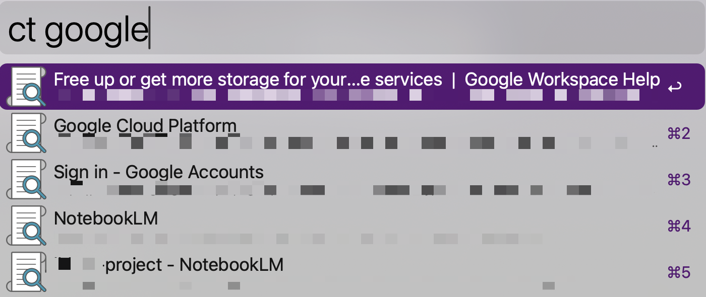

# Comet Tabs for Alfred

Instantly search and switch to any open [Comet](https://browser.comet.com/) tab from Alfred — across all windows and desktops.




## Features

- **Fuzzy search** all open Comet tabs across every window
- **Cross-desktop switching** — automatically moves to the correct macOS Space
- **Fast** — enumerates 100+ tabs in ~0.5 seconds
- Zero dependencies (pure JXA/AppleScript, ships with macOS)

## Installation

1. Download [`Comet-Tabs.alfredworkflow`](./Comet-Tabs.alfredworkflow)
2. Double-click to install in Alfred
3. Type `ct` followed by a space and your search term

**Requirements:**
- [Alfred 5](https://www.alfredapp.com/) with Powerpack
- [Comet](https://browser.comet.com/) browser
- macOS 13+ (Ventura or later)

## Usage

| Action | What it does |
|--------|-------------|
| `ct {query}` | Search all open tabs |
| `Enter` | Switch to the selected tab |

### Cross-desktop switching

To enable switching across macOS Spaces/desktops:

**System Settings > Desktop & Dock > "When switching to an application, switch to a Space with open windows for the application"** must be enabled.

## How it works

The workflow consists of two JXA (JavaScript for Automation) scripts:

- **`list-tabs-comet.js`** — Enumerates all Comet windows and tabs using per-tab iteration. Returns Alfred-compatible JSON with tab titles, URLs, and window/tab indices.

- **`focus-tab-comet.js`** — Activates the selected tab by:
  1. Setting the active tab index on the target window
  2. Reordering the window to frontmost (`win.index = 1`)
  3. Activating the app (triggers macOS Space switch)
  4. Raising the window via the Accessibility API (`AXRaise`)

### Why per-tab iteration?

Chromium-based browsers expose an AppleScript batch accessor (`windows.tabs.title()`) that works well on Chrome (~1s for 100 tabs). Comet's AppleScript bridge handles this poorly (~61s). Per-tab iteration (`windows[w].tabs[t].title()`) runs in ~0.5s — a 122x speedup.

## Building from source

The `.alfredworkflow` file is just a zip archive containing the scripts and `info.plist`. To rebuild:

```bash
cd /path/to/this/repo
zip -r Comet-Tabs.alfredworkflow info.plist list-tabs-comet.js focus-tab-comet.js
```

## License

MIT
